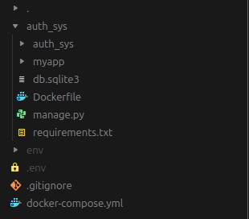

DevOps Project: User Authentication with Dockerized Django

DevOps Project: User Authentication with Dockerized Django
==========================================================

This is a sample DevOps project that implements user authentication using Django's inbuilt authentication module. The project is dockerized, and it runs as three microservices: Django, MariaDB, and Redis. Users can perform actions like logging in, logging out, and registering, and their state is maintained in the MariaDB database. In the future, Redis will be integrated for caching purposes.

Getting Started
---------------

1.  Clone the project repository to your local machine.
2.  Set up a Python virtual environment to manage dependencies. You can create a virtual environment using tools like \`virtualenv\` or \`venv\`. (Do this outside the \`auth_sys\` folder)
    
        python3 -m venv env

3.  Create a \`.env\` file to store the database creds (Do this outside the \`auth_sys\` folder)

        nano .env    

        DB_USER=<username>
        DB_PASSWORD=<password>
        DB_PORT=3306
        DB_NAME=login_register
4.  Build the Docker image for the project by running the following command in the project directory (Do this outside the \`auth_sys\` folder)
    
        sudo docker compose up --build
    
5.  Create a database in MySQL (MariaDB) by logging into the MariaDB container. Run the following command in seperate terminal.
    
        mysql -h 127.0.0.1 -u root -p
    
    If prompted for a password, refer to the \`docker-compose.yml\` file for the root password.
6.  After successfully logging in to the MariaDB container, create a new database named "login\_register" with the following SQL command:
    
        CREATE DATABASE login_register;
    
7.  With the database created, open the project in a web browser and start using it for user authentication.

Finally the folder structure would look like

Remember to configure the Django project settings to use the MariaDB database and, in the future will integrate Redis for caching.
But in this project the Django project settings is pre-configured and you should only update the .env file.

Project Structure
-----------------

The project directory should include the following components:

*   `Dockerfile`: Contains instructions for building the Docker image for the Django application.
*   `docker-compose.yml`: Defines the services and their configurations, including the MariaDB and Redis containers.
*   Django application code.
*   Other project-specific files and configurations.

Happy coding and enjoy your Dockerized Django user authentication project!